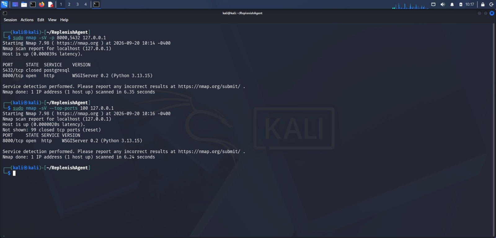
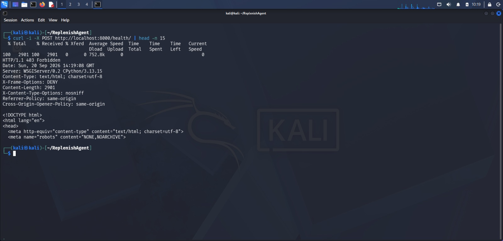
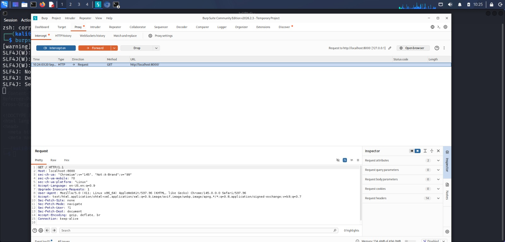
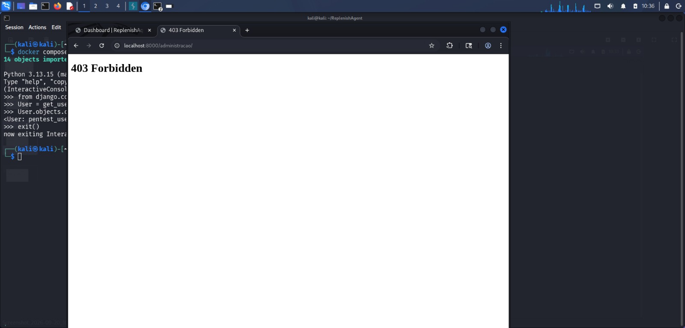
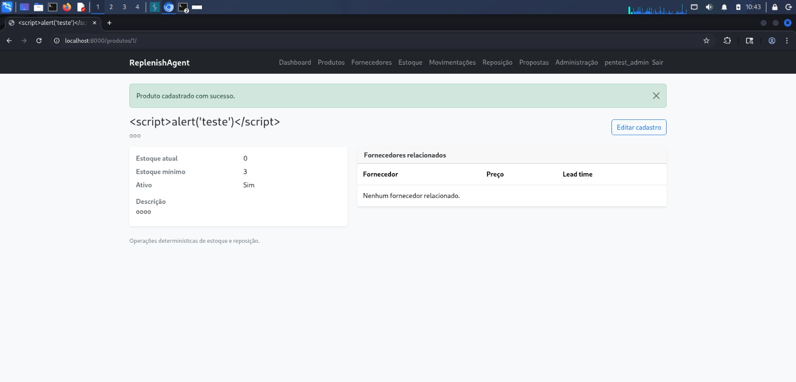

# Validação básica de segurança

Foi realizada uma validação básica de segurança do **ReplenishAgent** em ambiente controlado utilizando **Kali Linux**.

O objetivo não foi realizar um pentest completo, mas verificar alguns controles importantes da aplicação e demonstrar práticas básicas de segurança durante o desenvolvimento.

## Testes realizados

### 1. Exposição de serviços

Foi utilizado **Nmap** para verificar os serviços acessíveis no ambiente.

Resultados:

- Porta `8000` acessível para a aplicação web.
- Porta `5432` do PostgreSQL não exposta externamente.
- Nenhum outro serviço relevante identificado entre as portas verificadas.



### 2. Proteção CSRF

Foi realizada uma requisição `POST` sem token CSRF contra a aplicação.

A requisição foi rejeitada com:

`403 Forbidden`

O resultado confirma que a proteção CSRF do Django está ativa nesse fluxo.



### 3. Interceptação HTTP

O **Burp Suite** foi utilizado como proxy para interceptar e inspecionar requisições HTTP realizadas contra a aplicação.

Foi possível visualizar as requisições enviadas ao ReplenishAgent durante os testes.



### 4. Controle de acesso

Foi criado um usuário comum sem privilégios administrativos.

Ao tentar acessar diretamente uma área administrativa protegida, a aplicação respondeu:

`403 Forbidden`

Também foi verificado que operações protegidas, como a criação de produtos, não ficam disponíveis para usuários sem as permissões necessárias.



### 5. Teste básico de XSS

Foi inserido como nome de um produto o seguinte conteúdo:

```html
<script>alert('teste')</script>
```

A aplicação exibiu o conteúdo como texto e não executou o JavaScript.

O teste demonstra o escaping do conteúdo apresentado pelo template nesse fluxo, reduzindo o risco de XSS armazenado nesse ponto específico da aplicação.



## Resultado

Os testes básicos realizados não identificaram falhas críticas nos controles avaliados.

Foram observadas proteções importantes já presentes na aplicação:

- isolamento do PostgreSQL;
- proteção CSRF;
- controle de acesso baseado em permissões;
- escaping de conteúdo nos templates;
- headers de segurança fornecidos pelo Django.

> **Observação:** estes testes representam uma validação básica realizada em ambiente local e não substituem um pentest profissional ou uma auditoria completa de segurança.